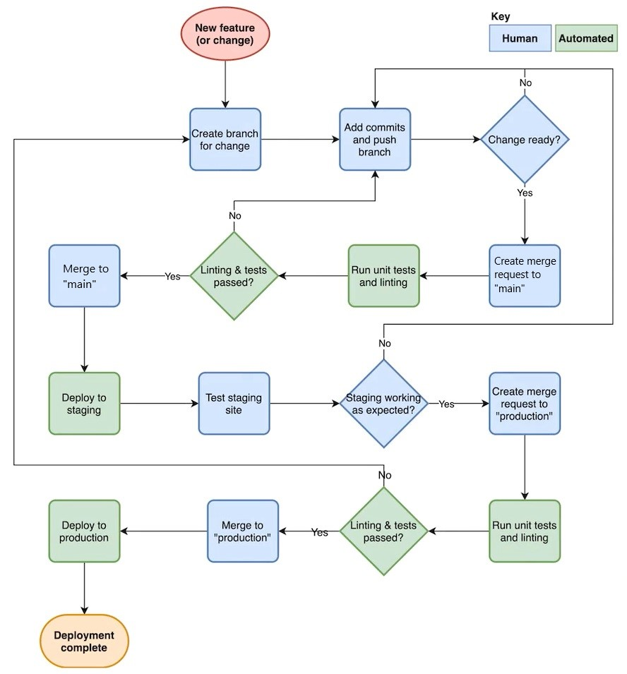
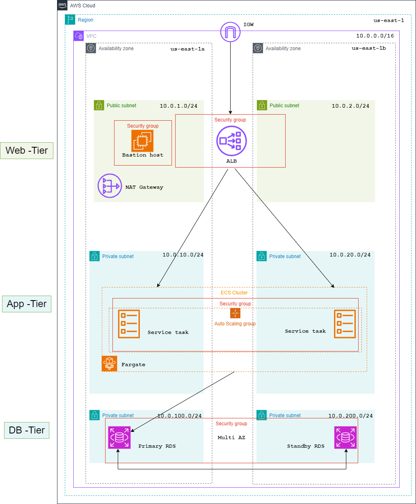

# 🎓Assignment 3: AWS IaC Challenge

## CI/CD pipeline flow for the deployment of application and infrastructure

### For new developers:

1) Clone the project 
2) Create a feature branch to implement changes
3) Create merge request to main branch when feature is completed and assign one of the maintainers to approve.
4) Merge to main branch (staging) will be granted if code is approved
5) Feature will be deployed in staging environment and tested (https://staging.motoyohosting.uk)
6) When deemed production ready a merqe request to the production branch will be created by the maintainers
7) The maintainer will manually trigger the Production Apply job. (https://www.motoyohosting.uk)

### For maintainers:

* You will be notified of any merge requests by the discord channel [wt-iac-team-1] [Server Yphilips]

1) When a new merge request arrives, please compare code to see if there are any conflicts
2) If feature is approved, grant merge request into main (Staging environment)
3) Notify other maintainers to test the environment
4) When deemed production ready, merge into production branch and manually execute the Production apply job.

!! A direct push to production branch is possible. But should be used with caution. The staging environment deployment will also be triggered.

#### Destroying staging or production

For the destruction of our environments: Manually trigger the jobs at the end of the ci/cd pipelines.

## Design of the infrastructure

## Security groups

### internet-alb-sg-r0785469

-- Allow Inbound --

| Source        | from port | to port | protocol   |
| :------------ |:---------:|:-------:|:----------:|
| 0.0.0.0/0     | 80        | 80      |http/tcp    |
| 0.0.0.0/0     | 443       | 443     |https/tcp   |

-- Allow Outbound --

| Destination   | from port | to port | protocol |
| :------------ |:---------:|:-------:|:--------:|
| 0.0.0.0/0     | all       | all     |all       |

### app-tier-sg-r0785469

-- Allow Inbound --

| Source          | from port | to port | protocol |
| :-------------- |:---------:|:-------:|:--------:|
|internet-alb-sg  | 80        | 80      |http/tcp  |
|bastion-host-sg  | 80        | 80      |http/tcp  |

-- Allow Outbound --

| Destination   | from port | to port | protocol |
| :------------ |:---------:|:-------:|:--------:|
| 0.0.0.0/0     | all       | all     |all       |

### db-tier-sg-r0785469

-- Allow Inbound --

| Source          | from port | to port | protocol |
| :-------------- |:---------:|:-------:|:--------:|
|app-tier-sg      | 3306      | 3306    |MySql/tcp |
|bastion-host-sg  | 3306      | 3306    |MySql/tcp |

-- Allow Outbound --

| Destination   | from port | to port | protocol |
| :------------ |:---------:|:-------:|:--------:|
| 0.0.0.0/0     | all       | all     |all       |

### bastion-host-sg-r0785469

-- Allow Inbound --

| Source          | from port | to port | protocol |
| :-------------- |:---------:|:-------:|:--------:|
| 0.0.0.0/0       | 22        | 22      | ssh/tcp  |

-- Allow Outbound --

| Destination   | from port | to port | protocol |
| :------------ |:---------:|:-------:|:--------:|
| 0.0.0.0/0     | all       | all     |all       |

## Routing Tables

### Web-Tier

| Destination   | target    | 
| :------------ |:---------:|
| 10.0.0.0/16   | local     |
| 0.0.0.0/0     | IGW       | 

### App-Tier

| Destination   | target    | 
| :------------ |:---------:|
| 10.0.0.0/16   | local     |
| 0.0.0.0/0     | NAT-GW    | 

### Database-Tier

| Destination   | target    | 
| :------------ |:---------:|
| 10.0.0.0/16   | local     |
