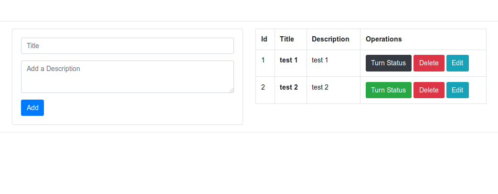

# Example Python Flask Crud

 Simple example python flask crud app for SQLAlchemy
 
## Screenshots

  
 
 
# Version

This version works with Gunicorn & SQLalchemy to connect to a remote SQL database and serve the webcontents via a WSGI

# Build the containter

docker build -t crud-app:latest .

# Run the container

To run the container you have to provide certain environment variables in runtime. These variables are used to connect to the mysql instance anc create the database tables. 

SQLALCHEMY_DATABASE_URI =f"mysql+pymysql://{os.environ['DB_USERNAME']}:{os.environ['DB_PASSWORD']}@{os.environ['DB_HOST']}/{os.environ['DB_NAME']}"

# Run command 

docker run -it -p 80:80 -e DB_USERNAME="username who has full root access" -e DB_PASSWORD="password of the root user" -e DB_HOST="ip address of fqdn" -e DB_NAME="entries"  crud-app:latest
